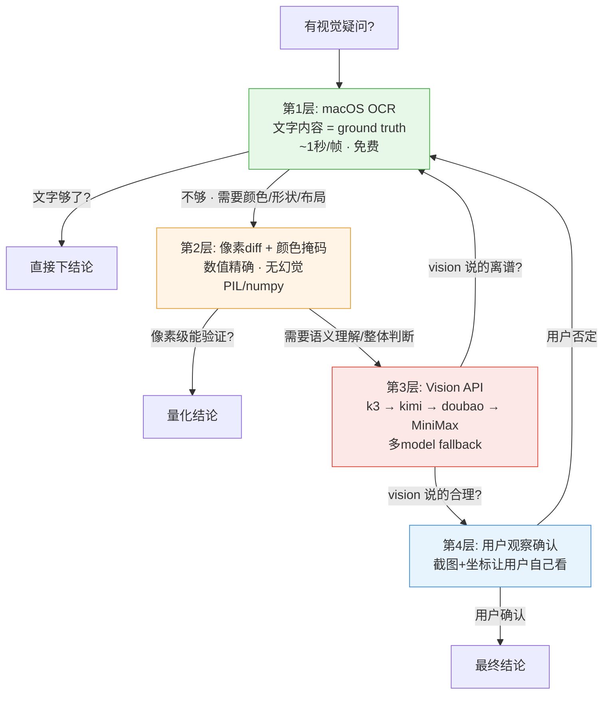

# video-vision-analyze

**视觉分析四层验证工具链** — 绕过 `vision_analyze` 503，通过多模型 fallback 链直接调用视觉 API。

## 核心理念

视觉分析 = **四层验证金字塔**，下层能解决就不要往上走：



vision 是辅助，不是答案。vision 的每一个结论都必须能用 OCR 或像素 diff 交叉验证。

## 何时使用

- 描述视觉内容（颜色、形状、布局、关系）— OCR 看不到的
- 逆向工程参考视频（什么配色、什么 UI 元素、什么动效、什么转场）
- 两帧视觉对比（"t=7.5s 和 t=7.75s 之间变了什么？"）
- QA 截图/渲染帧的视觉 bug
- 验证某个假设元素是否存在（红框、圆圈、箭头）— 视觉确认，不是像素猜测

## 何时不用

- 纯文字提取 → macOS Vision OCR（更快、免费）
- 纯像素级 diff/量化 → PIL/numpy（精确，无 API 成本）
- 大量帧批量 OCR → 批量 OCR（每帧 ~1s vs vision ~30s）

## 快速开始

```python
import sys
sys.path.insert(0, '/path/to/video-vision-analyze/scripts')
from vision_helper import vision_analyze

result = vision_analyze(
    image_path='/tmp/frame.jpg',
    question='这张图显示什么？是否有红框？',
    max_tokens=1500
)
print(result)
```

## 模型 Fallback 链（2026-08-16 验证）

| 优先级 | 模型 | 状态 | 备注 |
|---|---|---|---|
| 1 (默认) | **k3** | ✅ 快 + 准 + 稳定 | 首选 |
| 2 | kimi-k2.7 | ✅ 接近首选 | 视觉理解强 |
| 3 | doubao-seed-2.1-turbo | ⚡ 快 | 新加入，速度好 |
| 4 | MiniMax-M3 | ✅ 快 | 不错的兜底，能识别图中文字 |
| 5 | doubao-seed-2.0-pro | 🛡 准 | 慢但可靠，最终兜底 |

**已淘汰**（2026-08-13 实测）：kimi-k2.6/2.5 → 503、spark-x2 → 超时、hy3 → 无流式、glm-5.2 → 参数错误、qwen3.6/3.8 → 无权限

## 项目结构

```
├── SKILL.md                           # 完整 SOP + 陷阱清单
├── scripts/
│   ├── vision_helper.py              # 主入口：vision_analyze() + 多模型 fallback
│   ├── motion_analyzer.py            # 视频运动分析
│   └── scan_vision_models.py         # 模型可用性扫描
└── references/
    ├── macos-vision-ocr-recipe.md    # macOS Vision OCR 配方
    └── vision-model-scan-2026-08-13.md  # 模型扫描报告
```

## 关键陷阱（精简版）

1. **vision 会幻觉** — 系统 UI、信号图标、电量百分比，经常自己编出来
2. **颜色掩码不要硬编码** — #FF6B6B 珊瑚红不是 #FE2C55 正红，从宽阈值开始
3. **8fps 不够分析动效** — 找 easing curve 要用 30fps 抽帧
4. **contact sheet 比单帧高效** — 4×4 = 16 帧一张图，vision 能看时序上下文
5. **压缩后再做掩码** — vision 收到的是 1600px JPEG q=80，你做像素掩码也要用同一张

## 相关项目

- [video-sop-pipeline](https://github.com/young920/video-sop-pipeline) — 视频生产端到端 SOP
