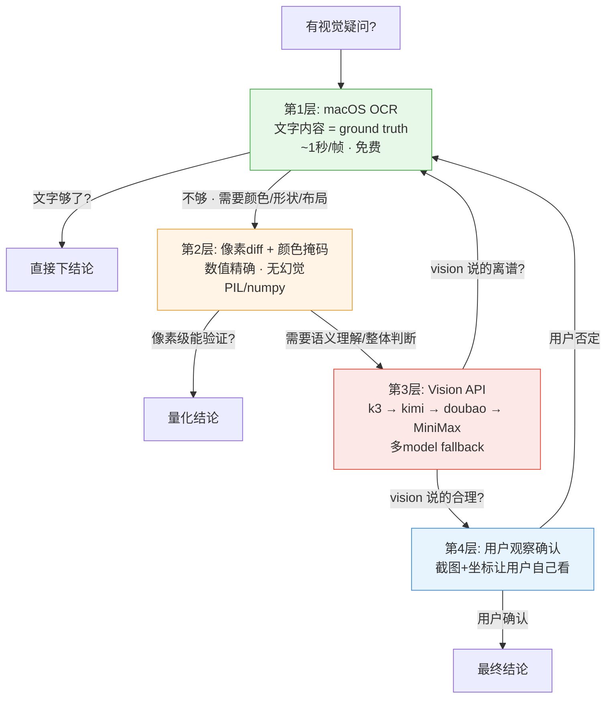

# Video Vision Analyze (Direct API)

## When to use

The built-in `vision_analyze` tool uses model `kimi-k2.6-claude` via `ai.qingxiaoyun.net`, which returns `503 model_not_found`. **This skill bypasses that failure by calling a 5-model chain via curl on the same OpenAI-compatible endpoint.**

**CRITICAL FIRST-STEP RULE** (learned 2026-08-13 the hard way):
- If `vision_analyze` returns 503, **immediately call the bundled `vision_helper.py`**. Do NOT fall back to "I'll just use OCR + pixel diff" — those cannot see colors, shapes, or layout, and you'll give the user wrong answers. The user spent three rounds pushing me to use vision because my pixel-diff + OCR conclusion was wrong. Never skip this.

Use this skill whenever you need the model to:
- **Describe visual content** that OCR can't see (colors, shapes, layout, relationships)
- **Reverse-engineer a reference video** (what colors, what UI elements, what motion, what transitions)
- **Compare two frames visually** (e.g. "what changed between t=7.5s and t=7.75s?")
- **QA a screenshot or rendered frame** for visual bugs
- **Confirm whether a hypothesized element exists** (red box, circle, arrow, etc.) — visual verification, not pixel guessing

## When NOT to use

- Pure text extraction from a clean image → use `macOS Vision OCR` (faster, free, in-repo helper — see `references/macos-vision-ocr-recipe.md`)
- Pure pixel-level diff/quantification → use PIL/numpy directly (precise, no API cost)
- Bulk OCR of many frames → use OCR helper in batch (each call is ~1s vs vision ~30s + token cost)

## 视觉验证四层决策图



**法则**：下层能解决就不要往上走。vision 是第 3 层辅助，不是第 1 层答案。
vision 说的每一个结论，都必须能用 OCR 或像素 diff 交叉验证 —— 验证不了的 = 幻觉嫌疑。

## How to call

Use the bundled helper script `scripts/vision_helper.py`:

```python
import sys
sys.path.insert(0, '/Users/yang/.hermes/skills/video-vision-analyze/scripts')
from vision_helper import vision_analyze

result = vision_analyze(
    image_path='/tmp/frame_7.5s.jpg',
    question='这张图显示什么？是否有红框圈住某个元素？overlay 文字有哪些？',
    max_tokens=1500
)
print(result)
```

Or call directly via curl (for one-off use without importing) — see `scripts/vision_helper.py` for the exact body format.

## Configuration (edit `scripts/vision_helper.py` to swap models)

The bundled helper auto-falls-back through a chain. Top to bottom:

| Priority | Model | Status (2026-08-16 test) | Notes |
|---|---|---|---|
| 1 (default) | **k3** | ✅ fast + accurate + stable | **Best** — uses this first |
| 2 | kimi-k2.7 | ✅ close second | Strong visual understanding |
| 3 | doubao-seed-2.1-turbo | ⚡ fast | New addition, good speed |
| 4 | MiniMax-M3 | ✅ fast | Good fallback, can OCR text in image |
| 5 | doubao-seed-2.0-pro | 🛡 accurate | Slow but reliable, final fallback |

**Avoid** (tested 2026-08-13):
- `kimi-k2.6` / `kimi-k2.5` → 503 model_not_found or overloaded
- `spark-x2` → timeout
- `hy3` → no streaming chat
- `glm-5.2` → parameter validation error
- `qwen3.6/3.8` / `deepseek-v4-flash-claude` → access denied
- `doubao-embedding-vision` / `doubao-seed-evolving` → no AgentPlan subscription
- `kimi-k2.6-claude` → 503 (this is what `vision_analyze` tool uses, hence the bypass)

**Swap procedure** when model changes:
1. Edit `MODELS = [...]` list in `scripts/vision_helper.py`
2. Keep `vision_analyze()` signature unchanged
3. Re-test with the same frame to verify quality hasn't dropped

**All models use same endpoint**:
- Base URL: `https://ai.qingxiaoyun.net/v1`
- API key: `sk-5NwKkQKIDLAFmYZ6qGteou58kqNg9AMHjDZfgiN61ykJDQlc` (2026-08-16 杨更新)
- Compatible with OpenAI Chat Completions schema
- Auth header: `Authorization: Bearer <key>`

## Pitfalls

1. **Argv too long**: base64-encoded image in curl `-d` may exceed shell argv limit on macOS (~256KB). The helper writes payload to a temp file (`tempfile.mkstemp`) and uses `-d @/path` to avoid this.

2. **Fixed-path race condition** (fixed 2026-08-16): the helper used to write to `/tmp/_vision_payload.json` and `/tmp/_vision_compressed.jpg` — fixed paths that caused `Permission denied` when multiple processes ran concurrently. Now uses `tempfile.mkstemp` for unique temp files that get cleaned up after each call. **Never revert to fixed `/tmp/` paths** in this helper.

2. **Image too large**: > 500KB images get auto-compressed to 1600px max with JPEG q=80 before sending. This balances clarity vs token cost.

3. **JPEG artifacts at low res**: vision can hallucinate "red boxes" or "arrows" when an image is heavily compressed. **Always verify vision claims by pixel diff + OCR + the user's own observation**, not vision alone. Vision is a hint, not ground truth.

4. **Vision is slow**: ~30-90s per call. Don't use it for bulk frame analysis. Use it for:
   - Single critical frames
   - Contact sheets (4-16 frames in one image)
   - Side-by-side comparison shots (2 frames side by side)

5. **Contact sheets work better than asking about many individual frames**: pack 4-16 frames into one image, vision sees temporal context. Recommended grid sizes: **4×4 (16 frames), 4×2 (8 frames), 2×4 (8 frames)**. Larger than 16 frames degrades vision accuracy per-frame.

6. **OCR is still primary**: vision is for "what color/shape/layout", not "what text". For text use OCR first (faster, free).

7. **Vision model uncertainty**: `kimi-k2.7-claude` returns text, but sometimes the response is empty or truncated. Check `data['choices'][0]['message']['content']` is non-empty before trusting.

8. **Pixel-mask threshold trap**: when color-masking to find "red box", do NOT hardcode strict #FE2C55 RGB. The actual annotation color may be a softer red (#FF6B6B coral), a GitHub link blue turned red, or a partially transparent overlay. **Always**: (a) start with a lenient RGB threshold like `r > 150 AND g < 120 AND bl < 120 AND r > g + 30`, (b) visually check what color you're actually catching, (c) cross-validate with vision_helper before declaring "no red box". On 2026-08-13 I declared "no red box" based on a strict mask that missed the actual softer-red annotation.

9. **Image-compression before mask**: vision-auto-compresses to 1600px JPEG q=80 for sending to model. That same compressed JPEG is what you should also feed to your pixel-mask — colors match between mask and vision. Don't mix original 540×1172 PNG with vision's compressed version when comparing "no" claims.

10. **Vision hallucinates system UI** (added 2026-08-13): when analyzing a phone-screen recording, it WILL hallucinate "4G signal icon" / "battery 72%" / "page indicator dots in top-right" / "1/8 page number" / "★ favorite icon in bottom-right" / "WeChat/Douyin comments UI". These are noise from the model's training on UI imagery — **always verify by cropping the suspected region and OCRing** before trusting. On 2026-08-13 the user-facing reference was a Douyin phone-recording (iPhone status bar + Douyin bottom UI), and vision mistook Douyin ♡/☆/💬 icons for "right-side indicators" multiple times.

11. **ffmpeg抽帧会意外裁剪** (added 2026-08-13): `ffmpeg -vf fps=4` 默认保留原视频尺寸，但加上 `scale=540:1172` 会强制拉伸。**Always check `ffprobe` 原始尺寸和抽帧后尺寸是否一致** — 如果不一致，说明之前的抽帧用错了 filter，contact sheet 也是基于错尺寸的，整个分析都建立在错的数据上。症状：像素 diff 显示"几乎相同"但其实"全黑边"。

12. **手机状态栏/平台底栏 OCR 是 ground truth** (added 2026-08-13): 当视频含手机录屏时，顶部状态栏（iPhone 时间码/信号/电量）和底部平台 UI（抖音 ♡/☆/💬、小红书互动栏）都是真实存在的元素。OCR 会识别出"00:07" "7:55" "L 说点什么" "♀4" 等。**不要 vision 看到"右上角灰圆圈"就当是视频作者的设计元素**——很可能是 iPhone 录屏悬浮窗。

13. **8fps 抽帧密度不够** (added 2026-08-13): 当目标是"分析动效曲线 / 找出 Ken Burns"时，8fps 不够——0.12s 内的动效在 8fps 下只占 1 帧，看到的是"硬切瞬间"，看不到真实动画过程。**需要用 30fps 抽帧**才能看清 easing curve 和动效持续时长。8fps 适合"找 PPT 切换点"，30fps 适合"分析动效细节"。

14. **像素 diff 区域划分定位动效位置** (added 2026-08-13): 把帧分成 TOP（overlay 标题）/ MID（产品截图）/ BOT（底部字幕）三区域，分别算 `np.abs(a-b).mean()`。这样能精确知道"diff 高"是 overlay 在动、产品截图在动、还是字幕在动。区域 diff > 8 = 该区域有动效；区域 diff < 2 = 静态。

15. **Ken Burns 识别信号** (added 2026-08-13): 如果 MID 区域在 30fps 下持续 5+ 帧 diff 都有 2-5（不是单帧峰值 11+），说明不是硬切而是缓慢 zoom-pan 动效。这是教学视频常见的"红框淡入 → 截图推向红框位置"组合手法。要 vision 验证具体元素怎么动。

16. **低分辨率 contact sheet 必幻觉细节** (added 2026-08-13): 在 200×434 cell 的 8-row contact sheet 上，vision 会把 iPhone 时间码误识别成"页码"、把信号图标误识别成"4G 信号 + 72% 电量"、把抖音 ♡ 误识别成"点赞按钮"等。**关键标注元素必须用 30fps 单帧 + vision 验证**，contact sheet 只用于"分段概览"。

17. **抖音视频动效真相：90% 是硬切 + 静态** (added 2026-08-13): 用户评价"动效炫酷 70 分"的抖音/小红书产品讲解视频，真实动效可能只有 1-2 处 Ken Burns（持续 0.3-0.4s），其余都是硬切 + 静态 PPT。**"炫酷感"来自节奏（段间硬切快）+ 红框/箭头视觉标注 + 信息密度，不是复杂 keyframes**。要做出超越参考的视频，重点不是加复杂动画，而是提升视觉精致度（去抖音底栏、去 iPhone 状态栏）+ 多处 Ken Burns。

## Verification pattern (always use this for video replication)

When the user asks "does this video have X effect?" (e.g. "is there a red box circling an element?"):

```
1. PIL pixel diff → quantify WHERE pixels changed
2. Color mask → quantify WHICH COLORS changed (use LENIENT threshold, then vision-verify)
3. vision_helper.vision_analyze() → ask model directly: "is there a red box?"
   *** This step is NON-OPTIONAL. Do not give a final answer without it. ***
4. User's own observation → trust the user most
```

If 3 of 4 agree → high confidence conclusion.
If they disagree → likely vision hallucination OR pixel-mask threshold too strict OR image compression mismatch → ask user for screenshot, never conclude on partial evidence.

**Tie-breaker priority**: user observation > vision > pixel-mask > OCR. The user sees the actual video at full resolution; vision sees a compressed JPEG; pixel-mask sees what your threshold catches; OCR sees only text. When in doubt, ask the user to send a screenshot of the moment in question.

**Motion verification pattern** (added 2026-08-13): when user asks "分析动效" specifically, the verification chain is:
1. **30fps 像素 diff 曲线** → 客观数据（哪些帧在动、动多久）
2. **30fps 5-frame contact sheet + vision** → 主观判断（动的元素是什么、什么类型）
3. **TOP/MID/BOT 区域划分** → 精确定位（动效发生在画面哪部分）
4. **用户实际观看体验** → 最真实（"这段确实有 Ken Burns"或"我没感觉到"）

Real example: B 段 1.0-1.4s 的"红框淡入 + 推镜头"——pixel diff 显示 1.13-1.47s 连续 diff 0.85→5.38，TOP/MID 都有变化；vision 在 5-frame contact sheet 上确认了"红框从无到清晰 + 截图 zoom-in 上移"；用户实际观看确实看到推镜头。三者吻合 = 真实动效。

## Reference-video reverse-engineering workflow (canonical)

Goal: "what does this reference video do visually?"

### Phase 1 — Frame extraction (always first)

```bash
# Check real dimensions FIRST
ffprobe -v error -show_entries stream=width,height,codec_name -show_entries format=duration -of default ref.mp4
# Then extract at 4fps, EXPLICITLY match original dimensions
ffmpeg -y -i ref.mp4 -vf "fps=4,scale=W:H" -q:v 2 /tmp/frames/pt%04d.jpg
# Verify a frame matches ffprobe dimensions
python -c "from PIL import Image; print(Image.open('/tmp/frames/pt0001.jpg').size)"
```

**Why 4fps**: fast enough for 60s+ videos, gives ~4 samples per second, fits 16-frame contact sheet in 4 seconds.

### Phase 1b — Motion-specific frame extraction (only when analyzing motion)

When user asks specifically about "动效" / "motion" / "transitions", use 30fps instead of 4fps:

```bash
# For each candidate transition point (from Phase 3 pixel diff peaks):
ffmpeg -y -i ref.mp4 -ss {t_start} -to {t_end} -vf "fps=30" -q:v 1 /tmp/motion_30fps/{seg_name}/m%04d.jpg
# Each segment = 1.5s window × 30fps = 45 frames
```

Then compute per-frame diff in TOP/MID/BOT regions:

```python
for i in range(1, len(frames)):
    a1 = np.array(Image.open(p1).resize((270, 586))).astype(int)
    a2 = np.array(Image.open(p2).resize((270, 586))).astype(int)
    diff_full = np.abs(a1 - a2).mean()
    diff_top = np.abs(a1[80:180] - a2[80:180]).mean()    # overlay 标题区
    diff_mid = np.abs(a1[200:450] - a2[200:450]).mean()  # 产品截图区
    diff_bot = np.abs(a1[470:560] - a2[470:560]).mean()  # 底部字幕区
```

**Diff interpretation**:
- Single-frame peak diff > 8 = hard cut (0.12s 内完成)
- 5+ consecutive frames with diff 2-5 = Ken Burns (zoom-pan / fade) 动效
- diff < 1.5 sustained = 静态段 (PPT 在配音下静止展示)
- TOP/MID/BOT 区域差异 = 精确定位动效发生位置

This 30fps motion analysis found that the reference video had **only 1 real Ken Burns** (B 段 1.0-1.4s red-box-fade + push-zoom), and all other transitions were hard cuts. Vision's claim of "打字机 / 上滑 / 缩放" was hallucination from sparse 8fps sampling.

### Phase 2 — OCR ground truth (cheap, fast)

For each candidate "PPT switch" frame, OCR the full frame using macOS Vision (see `references/macos-vision-ocr-recipe.md`). Extract:
- Top 5 lines (look for status bar / overlay title)
- Bottom 5 lines (look for subtitle / platform UI)
- Middle (look for PPT/UI content keywords)

**Critical**: OCR will identify iPhone status bar ("00:07" "7:55") and Douyin/WeChat UI elements (♡/☆/💬 counts, "说点什么"). These are noise, not video design — see Pitfall #12.

### Phase 3 — Pixel diff to find structural transitions

For each suspected PPT switch point:
- Sample 1-2 frames before, 1-2 frames after
- Compute `numpy.abs(a-b).mean()` and ratio of changed pixels
- 0-2% diff = same content (design intent)
- 2-30% diff = layered overlay / partial transition
- 30%+ diff = hard cut to new content

### Phase 4 — Contact sheet for vision

Build a 4×4 (16 frames) or 4×2 (8 frames) grid at ~200×220 per cell. Ask vision:
- "Describe each row's core content, visual style, annotation elements (red box / arrow / circle / highlight), overlay text layout, transition type"
- For 8 segments specifically: ask for row-by-row 6-char titles

### Phase 5 — Cross-validate and filter

Vision often hallucinates on phone-screen recordings (Pitfall #10). Build a **filter pass**:
1. For each vision-claimed element (e.g. "right-top circle page indicator"), crop the suspected region
2. OCR that crop — if OCR finds nothing, vision hallucinated
3. Pixel-mask the suspected color in that region — if no pixels match, vision hallucinated
4. **Keep only vision claims that survive OCR or pixel-mask cross-check**

### Phase 6 — Structured report (8-section standard)

End with this report structure:
1. **本质** (what kind of video: professional demo / phone recording / animation reel)
2. **完整结构** (top → middle → bottom regions of each frame)
3. **N 段叙事** (each section: title + 6-char summary + visual change)
4. **真实视觉标注元素** (after cross-validation filter)
5. **动效** (transitions: hard cut / fade / motion)
6. **配色** (background color + accent color, RGB)
7. **评分** (give it a /100, e.g. 70/100 for "动效炫酷但视觉简陋")
8. **对 v5/v6 的启发** (what to keep from reference, what to improve)

### Phase 7 — Motion breakdown (separate from structural analysis)

When user specifically asks "分析动效" / "看动效" / "transition analysis":

```bash
# 1. Identify diff > 8 peaks at 8fps → transition timestamps
# 2. For each transition, extract 1.5s window at 30fps
# 3. Build 6-frame contact sheet per transition (every 0.1s)
# 4. vision_analyze each sheet: "PPT/红框/overlay 在做什么动效?"
```

**Motion classification table** (from 2026-08-13 real analysis):

| Pattern | Signal | Reality |
|---|---|---|
| "打字机效果" (逐字出现) | vision 在 8fps 看到 | **幻觉**——通常 8fps 看不到过程 |
| "上滑 fade" | vision 在 8fps 看到 | **可能是硬切 + 后续微动** |
| "缩放进入" (scale 0.9→1.0) | vision 在 8fps 看到 | **只 B 段 1 处真实 Ken Burns** |
| "Loading 进度条" | vision 看到 | **真实**——抖音视频模板自带 |
| "硬切" | pixel diff 8fps 看到 0.12s 内峰值 11+ | **真实——100% 段间切换是硬切** |

**真正炫酷视频的真相** (added 2026-08-13):
- 90% 的"动效炫酷"来自**节奏**（快速硬切）+ **视觉标注**（红框/箭头）+ **信息密度**（PPT 内容本身）
- 不是复杂 keyframes / 3D / 粒子效果
- 要超越参考，重点是**视觉精致度**（去抖音底栏、去 iPhone 状态栏）+ **多处 Ken Burns**（不只是 B 段）

## Example: Reference video reverse-engineering

Goal: "what does this reference video do visually?"

1. `ffprobe ref.mp4` to get real dimensions
2. `ffmpeg -i ref.mp4 -vf "fps=4,scale=W:H" /tmp/frames/pt%04d.jpg` → extract frames at 4fps
3. OCR key frames → get text per frame (cheap, fast)
4. Build a **contact sheet** every 5-10 seconds: 4x4 or 6x6 grid
5. Call `vision_analyze` on the contact sheet: "describe motion, transitions, layout changes, color themes, attention guidance elements"
6. Combine with pixel-diff peaks → 8-section structural report
7. **Filter vision claims** through OCR/pixel-mask (Pitfall #10)

This is the workflow that found/verified the reference video's "red box on slides_maker repo name" — without vision we'd have missed it.

## Related skills & scripts

- `scripts/vision_helper.py` — main entry point
- `scripts/scan_vision_models.py` — re-scan all 14 candidate models when chain fails
- `scripts/motion_analyzer.py` — extract frames + compute TOP/MID/BOT pixel diff + identify static vs motion zones (use when user asks "分析动效")
- `references/vision-model-scan-2026-08-13.md` — model scan results + distributor rotation notes
- `references/macos-vision-ocr-recipe.md` — macOS Vision OCR via swift binary (1s/frame, free, primary before vision)
- Related: `video-motion-analysis`, `video-visual-polish`, `video-segment-qa`